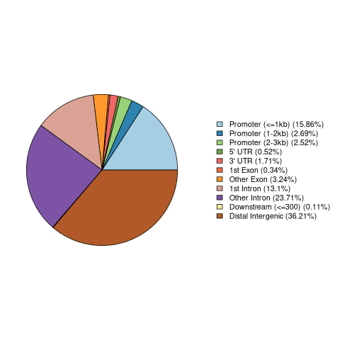

# Гистоновая метка H3K27ac, клеточная линия A549

## Анализ пиков гистоновой метки

### Подготовка .bed-файлов

После скачивания распаковал, оставил 5 столбцов и переименовал:

```
$ zcat ENCFF443MVY.bed.gz | cut -f1-5 > H3K27ac_A549.ENCFF443MVY.hg38.bed
$ zcat ENCFF926NKP.bed.gz | cut -f1-5 > H3K27ac_A549.ENCFF926NKP.hg38.bed
```

### hg38 -> hg19

```
$ liftOver H3K27ac_A549.ENCFF443MVY.hg38.bed hg38ToHg19.over.chain.gz \
    H3K27ac_A549.ENCFF443MVY.hg19.bed H3K27ac_A549.ENCFF443MVY.unmapped.bed
$ liftOver H3K27ac_A549.ENCFF926NKP.hg38.bed hg38ToHg19.over.chain.gz \
    H3K27ac_A549.ENCFF926NKP.hg19.bed H3K27ac_A549.ENCFF926NKP.unmapped.bed
```

### Гистограммы длин пиков

hg38                                                                 | hg19
---------------------------------------------------------------------|---------------------------------------------------------------------
 | 
 | 

### Фильтрация

Я выбрал порог 10'000, потому что по гистограммам видно, что большинство пиков
имеют меньшую длину, а пики большей длины бывают очень длинные.

ENCFF443MVY                                                                           | ENCFF926NKP
--------------------------------------------------------------------------------------|--------------------------------------------------------------------------------------
 | 

### Расположение пиков относительно участков генома

ENCFF443MVY | ENCFF926NKP
------------|------------
 | 

### Объединение

```
$ cat *.filtered.bed | sort -k1,1 -k2,2n | bedtools merge \
    > H3K27ac_A549.merge.hg19.bed
```

## Анализ участков G4

G4-ChIP уже в одном файле, так что никакая подготовка не была нужна.

### Пики G4-ChIP


### Расположение пиков G4-ChIP относительно участков генома


## Анализ пересечений гистоновой метки и структуры ДНК

Пересечение было получено с помощью:

```
$ bedtools intersect -a G4_chip.bed -b H3K27ac_A549.merge.hg19.bed \
    > H3K27ac_A549.intersect.G4.bed
```

### Длины пересечений


### Геномный браузер

Сессия доступна в файле `ucsc_session`.

Пересечение рядом с аннотированным геном по координатам
`chrX:1,571,450-1,572,508`:


### Ассоциация с генами

Проассоциировано 8198 пиков с 6770 генами. Получил с помощью запуска `wc` на
соответствующих файлах, а потом вычел единицу, чтобы учесть заголовок.

### GO-анализ

Выборка самых узких категорий с наименьшим FDR:

Категория | FDR
----------|----
cellular nitrogen compound metabolic process | 7.64E-50
cellular macromolecule metabolic process | 7.20E-64
detection of chemical stimulus involved in sensory perception of smell | 3.19E-49
sensory perception of chemical stimulus | 2.23E-51
G protein-coupled receptor signaling pathway | 4.21E-50
